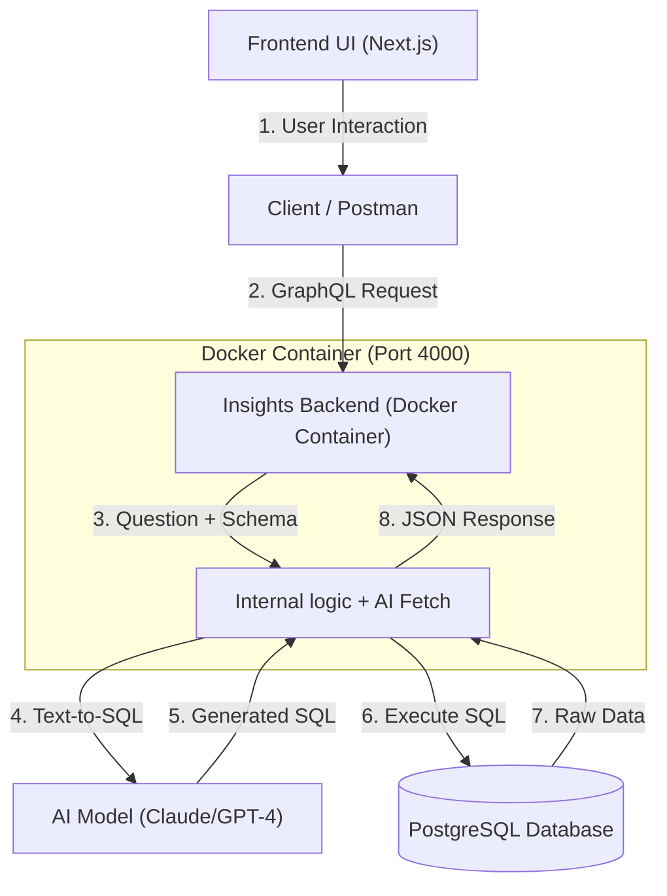

# Aime Insights: Architecture & Data Flow Explained

This document explains how your application handles data, how it is containerized with Docker, and the "magic" behind the AI-powered chat.

---

## 1. The Database Layer
### Where is data stored?
- **PostgreSQL**: The application uses a PostgreSQL database.
- **Unified View (Dynamic)**: The `attendee` object is a **SQL VIEW**. It does not store data itself; it is a "virtual window" that joins 4-5 different backend tables live.
- **Why this matters**: If you change a name in the `registrations` table, the `attendee` view (and thus the AI) sees it **instantly**. There is no "sync" delay.
- **Other Methods Matrix**:
  | Method | Real-Time? | Speed | Best For |
  | :--- | :---: | :---: | :--- |
  | **SQL View** | ✅ Yes | 🟡 Med | Current stage / Clean AI context |
  | **Materialized View** | ❌ No | ✅ Fast | Large tables (needs 10min refresh) |
  | **Physical Tables** | ❌ No | ✅ Fast | Enterprise scale (complex sync) |
  | **Dynamic Joins** | ✅ Yes | 🟡 Med | Advanced data discovery |

### Deep Dive: Why use Views?
For **Aime Insights**, we primarily use **SQL Views** for several strategic reasons:
1.  **Zero Maintenance**: Since it is a virtual table, you don't need a background job to keep it in sync. 
2.  **Clean Context for AI**: The AI performs best when it has a "clean window" to look through. Instead of giving the AI 5-10 messy raw tables, we give it one refined View.
3.  **Real-Time Accuracy**: In event management, data changes every second. Views ensure the AI is never looking at "stale" data.

#### When to switch to other methods?
- **Materialized Views**: If your database reaches 1,000,000+ rows and the chat starts feeling slow (e.g., taking 5+ seconds), you can convert the View to a Materialized View to "hard-save" the results for speed.
- **Physical Tables**: Use this if you need to perform "ETL" (Extract, Transform, Load) to compute complex metrics that SQL alone cannot handle efficiently.
- **Query Library (The "Pick a Template" Method)**: 
  - **Proposed alternative**: Instead of a View, you store a `.sql` file on the server (e.g., `templates/attendee_report.sql`). 
  - **Advantage**: Very secure. You don't need "Create View" permissions in the DB. 
  - **Disadvantage**: Rigid. If the AI needs to combine data from two different files, it has to write much more complex SQL than if it just looked at a single View.

### How is data fetched? (Load Handling & Security)
- **Multi-User Performance**: 
  - **Connection Pooling**: We use a pool of 10 connections. If 100 people query at once, the system **queues** them. This prevents "Database Fatigue" and ensures the server doesn't crash from too many sessions.
  - **Non-Blocking IO**: Since the backend is built on Node.js, it can handle thousands of concurrent requests without waiting for the database to finish one before starting another.
- **Hard Constraints (The Kill Switches)**:
  - **Statement Timeout**: Every query has a **3-second limit**. If someone asks a question that would take 10 minutes to run, the system kills it after 3 seconds to protect other users.
  - **Memory Limits**: The AI logic is capped within the Docker container to ensure it doesn't "leak" or eat up all your system RAM.

---

## 2. Dockerisation
Docker "packages" the app into a container so it runs exactly the same way on any machine.

### `Dockerfile.insights`
This is the build script for the backend. It:
1.  Starts with a **Node.js** base image.
2.  Installs all **dependencies** (from `package.json`).
3.  **Compiles** the TypeScript code into executable JavaScript.
4.  Starts the server on **Port 4000**.

### `docker-compose.yml`
This is the orchestrator. It tells Docker:
- **Frontend vs Backend**: The Frontend (Next.js UI) runs on **Port 3000**. It acts as the "Client" that sends requests to the Dockerized Backend.
- **Port Mapping**: 
  - **Port 3000**: Main Web Application (Next.js). This is where you see the tables and charts.
  - **Port 4000**: Dedicated AI Backend (Docker). This is the engine that processes natural language and queries the database.

---

## 3. How the AI Chat works (GraphQL)
The chat relies on a technique called **Text-to-SQL**. When you ask a question like *"How many people are from Google?"*, here is the sequence:

## Why two ports?
1.  **Port 3000 (The Face)**: This is your standard web server. It handles the UI, routing, and visuals.
2.  **Port 4000 (The Brain)**: This is a specialized service. By keeping the AI logic and heavy database processing in a separate Docker container on Port 4000, we make the system more modular and easier to scale.

---

### Step 1: User Request
- **Dynamic EventID**: By default, it uses `5281`, but it is **not hardcoded**. 
- **How it changes**: You can pass a different `eventId` in your Postman variables. The UI also detects which event you are viewing and passes that ID to the backend automatically.

### Step 2: Schema Context Retrieval
Before talking to the AI, the backend queries the database's **Metadata**.
- It runs a special query to get the names of all columns in the `attendee` table.
- This ensures the AI knows exactly what columns are available (e.g., it knows to use `company_name` instead of just `company`).

### Step 3: AI Translation (LLM)
The backend sends your question + the list of column names to the AI (Claude/GPT).
- **Instruction**: *"You are a SQL expert. Write a PostgreSQL SELECT query to answer this question."*
- **Result**: The AI returns raw SQL code: `SELECT COUNT(*) FROM attendee WHERE company_name ILIKE '%Google%';`

### Step 4: SQL Execution
The backend executes that generated SQL against your actual database and gets the results (e.g., `42`).

### Step 5: Natural Language Formatting
The AI takes that `42` and your original question and turns it into a friendly sentence: *"There are 42 attendees from Google."*

---

## Architectural Flow Summary

## Scalability: Adding More Reports (Room, Air, etc.)
This system is a **General Intelligence Engine**. It is not limited to Attendees.

### How to add a "Room" or "Air" report:
1.  **Create a View**: Create a new SQL view (e.g., `public.room_report`).
2.  **Add to Schema**: Update the `getAttendeeSchemaText` to include the schema of your new report view.
3.  **AI Automatic Routing**: You don't need to write new code! The AI will see the new tables in the "Context" and automatically decide which table to use based on the question.
    - Question about flights? -> AI targets `air_report`.
    - Question about hotels? -> AI targets `room_report`.

---

## EventID Control Flow
The `EventID` is the "Passport" for every request. It is **never hardcoded** in a way that blocks other data.

1.  **User Choice**: User clicks an event in the UI (Port 3000).
2.  **State Management**: The `ui-store.tsx` captures this ID.
3.  **API Transport**: The ID is sent as a variable to the GraphQL API (Port 4000).
4.  **Security Filtering**: The backend forces the AI to add `WHERE event_id = X` to every SQL query it generates.

---

## Technical Details Summary
| Detail | Value / Mechanism |
| :--- | :--- |
| **Port 3000** | Next.js Frontend (The Face) |
| **Port 4000** | Node.js Backend in Docker (The Brain) |
| **Max Concurrent Queries** | 10 (Queued via PG Pool) |
| **Kill Switch** | 3000ms Statement Timeout |
| **Attendee Data** | SQL View (Dynamic / Live) |
| **EventID** | Dynamic (passed via GraphQL variables) |

---

## Evolution: Using MCP (Model Context Protocol)
MCP is a new standard for connecting AI models to tools and data.

### Can it be used for Aime Insights?
**Yes.** Instead of our custom "Text-to-SQL" bridge, we could run an **MCP Postgres Server**.

### 🟢 Advantages:
- **Standardization**: Uses a standard protocol supported by many AI engines (Claude, etc.).
- **Security**: MCP servers have built-in security layers for tool access.
- **Ecosystem**: Easily connect other tools (like Gmail or Slack) to the same chat interface later.

### 🔴 Disadvantages:
- **Complexity**: It adds another layer (the MCP server) between the chat and the database.
- **Latency**: There might be a slight overhead in communication between the AI and the MCP server.
- **Customization**: Our current system is 100% custom-tuned for *event data* (like the 3-second kill switch). Generic MCP servers might need a lot of configuration to match this logic.

### Recommendation:
Stay with the current **Direct Bridge** for now because it is faster and gives us full control over the SQL Guard and Timeouts. Switch to MCP if you plan to integrate **multiple external tools** beyond just the database.

---

**Last Updated:** February 2, 2026, 12:00 PM UTC
