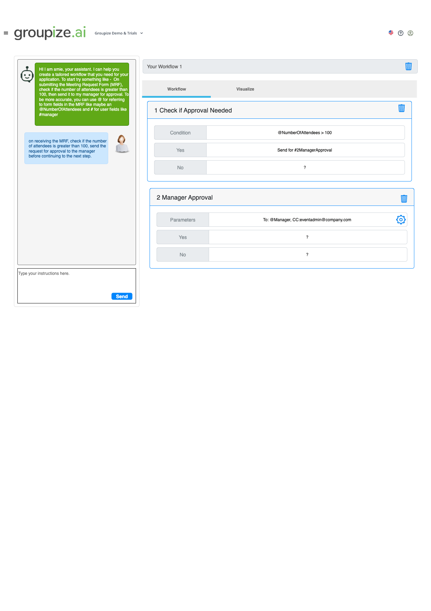

# Epic: Workflow Configurator Screen

**As a** meeting planner or administrator  
**I want** a comprehensive workflow configurator interface with AI assistance  
**So that** I can create, edit, and visualize complex event planning workflows with conditional logic and pre-defined functions

## Summary
A dual-pane workflow configurator that combines conversational AI assistance with visual workflow representation for creating and managing event planning workflows.

## Overview
The workflow configurator is a core component of the "aime" (AI Meeting Engine) system that enables users to create sophisticated workflows for event planning and meeting management. The interface features an AI assistant named "aime" that helps users through conversational prompts to generate workflow JSON, which is then visualized in real-time using Mermaid diagrams.

## UI Wireframe Reference
The interface design follows this wireframe specification:



*The wireframe shows a dual-pane layout with the conversational AI interface on the left and the visual workflow representation on the right, supporting both creation and editing modes.*

## Key Components

### 1. AI Conversation Interface (Left Pane)
- **Conversational AI Assistant**: "aime" guides users through workflow creation
- **Context-Aware Prompting**: AI understands meeting planning domain and available functions
- **Edit Mode Support**: Shows conversation history for existing workflows
- **Multi-LLM Support**: Configurable backend (OpenAI/Anthropic) based on environment flags

### 2. Visual Workflow Display (Right Pane)
- **Real-time Visualization**: Dynamic Mermaid diagram generation
- **Interactive Flow Charts**: Visual representation of workflow steps and conditions
- **Markdown Rendering**: Uses react-md-editor for Mermaid diagram display
- **Responsive Design**: Adapts to different screen sizes and embedded contexts

### 3. Workflow Engine Integration
- **JSON Schema Compliance**: Generates workflows compatible with json-rules-engine
- **Pre-defined Functions Library**: Integration with event planning functions
- **Conditional Logic**: Support for complex branching based on form data and user attributes
- **Parallel Execution**: Support for splitting and merging workflow paths

## Pre-defined Functions Library
The AI assistant has access to a comprehensive library of event planning functions:
- `requestApproval` - Send approval requests to managers/stakeholders
- `collectMeetingInformation` - Gather additional details from requesters
- `splitUpToExecuteParallelActivities` - Create parallel workflow branches
- `waitForParallelActivitiesToComplete` - Synchronization point for parallel flows
- `callAnAPI` - External system integration
- `createAnEvent` - Generate calendar events and bookings
- `terminateWorkflow` - End workflow with success/failure status
- `surveyForFeedback` - Post-event feedback collection
- `validateRequestAgainstPolicy` - Policy compliance checking
- `validatePlanAgainstPolicy` - Final plan validation

## Workflow Types and Triggers

### Primary Triggers
- **MRF Submission**: Meeting Request Form completion
- **Direct Meeting Request**: Ad-hoc meeting requests
- **Scheduled Review**: Periodic workflow execution
- **External API Call**: Third-party system integration

### Sample Workflow Scenarios
1. **Large Event Approval Flow**: Events >100 attendees require management approval
2. **Policy Validation**: Automatic checking against company meeting policies
3. **Resource Allocation**: Room booking and catering coordination
4. **Multi-Department Events**: Parallel approval and coordination workflows
5. **Feedback Collection**: Post-event survey and analysis

## Sample Workflow References

### Visual Workflow Example


*This diagram illustrates a complex workflow with conditional branching, parallel execution, and multiple decision points typical of enterprise event planning.*

### JSON Workflow Structure Example
Based on the copilot instructions, here's a sample workflow structure that demonstrates the json-rules-engine format:

```json
{
  "steps": {
    "start": {
      "name": "Start", 
      "type": "trigger",
      "action": "onMRFSubmit",
      "params": { "mrfID": "abcd", "MRF Name": "New Event Request" },
      "nextSteps": ["checkForApproval"]
    },
    "checkForApproval": {
      "name": "Check for Approval",
      "type": "condition",
      "condition": {
        "all": [
          { "fact": "form.numberOfAttendees", "operator": "greater than", "value": 100 },
          {
            "any": [
              { "fact": "user.role", "operator": "not equal", "value": "admin" },
              { "fact": "user.department", "operator": "not equal", "value": "management" }
            ]
          }
        ]
      },
      "onSuccess": "sendForApproval",
      "onFailure": "createEvent"
    },
    "sendForApproval": { 
      "name": "Send for Approval",
      "type": "action", 
      "action": "functions.requestApproval", 
      "params": { "to": "manager@example.com", "cc": "team@example.com" },
      "onSuccess": "createEvent",
      "onFailure": "terminateWithFailure"
    },
    "createEvent": { 
      "name": "Create Event", 
      "type": "action", 
      "action": "functions.createEvent", 
      "params": { "mrfID": "abcd" },
      "nextSteps": ["end"]
    },
    "terminateWithFailure": { 
      "name": "Notify User of Failure", 
      "type": "action", 
      "action": "functions.sendFailureEmail", 
      "params": { "emailTemplateID": "workflow_failure", "cc": "team@example.com" },
      "nextSteps": ["end"]
    },
    "end": { "type": "end", "result": "success" }
  }
}
```

*This example demonstrates conditional logic, parallel actions, and error handling patterns that the configurator should support.*

## Technical Architecture

### AI Integration
- **Prompt Engineering**: Domain-specific prompts for meeting planning workflows
- **Context Injection**: User roles, team structure, and available functions
- **JSON Generation**: LLM produces valid json-rules-engine schema
- **Mermaid Generation**: Separate LLM call for visual diagram creation

### Data Flow
1. User interacts with "aime" through conversational interface
2. AI processes intent and generates/updates workflow JSON
3. Workflow JSON is validated against json-rules-engine schema
4. Mermaid diagram is generated from workflow structure
5. Visual representation is rendered in right pane
6. Workflow is saved and can be executed by the workflow engine

### Technology Stack
- **Frontend**: Next.js 15 with App Router and TypeScript
- **UI Framework**: Material-UI v7 components with Tailwind v4 styling
- **AI Integration**: OpenAI v5 SDK and Anthropic SDK v0.63.0
- **Workflow Engine**: json-rules-engine v7.3.1
- **Visualization**: react-md-editor v4 with Mermaid v11 support
- **Validation**: Zod v4 for schema validation

## User Experience Flow

### Creating New Workflow
1. User opens workflow configurator
2. "aime" greets user and asks about workflow purpose
3. User describes desired workflow in natural language
4. AI asks clarifying questions about triggers, conditions, and actions
5. Workflow JSON is generated and displayed visually
6. User can refine through additional conversation
7. Final workflow is saved and activated

### Editing Existing Workflow
1. User selects existing workflow to edit
2. Conversation history with "aime" is displayed
3. Current workflow visualization is shown
4. User describes desired changes
5. AI updates workflow JSON incrementally
6. Updated visualization reflects changes
7. Modified workflow is saved

### Workflow Visualization
1. Real-time Mermaid diagram generation
2. Color-coded steps (triggers, conditions, actions, end states)
3. Interactive elements for step details
4. Zoom and pan capabilities for complex workflows
5. Export options for documentation

## Success Metrics
- **User Adoption**: Number of workflows created through the configurator
- **Workflow Complexity**: Average number of steps and conditions per workflow
- **AI Accuracy**: Percentage of workflows requiring minimal manual adjustment
- **User Satisfaction**: Feedback scores on the conversational interface
- **Time to Create**: Reduction in workflow creation time vs. manual methods

## Security and Compliance
- **Data Privacy**: Conversation logs and workflow data encryption
- **Access Control**: Role-based permissions for workflow creation and editing
- **Audit Trail**: Complete history of workflow changes and AI interactions
- **API Security**: Secure integration with external LLM services
- **Validation**: Input sanitization and workflow schema validation

## Future Enhancements
- **Workflow Templates**: Pre-built templates for common scenarios
- **A/B Testing**: Workflow performance comparison
- **Advanced Analytics**: Workflow execution metrics and optimization suggestions
- **Multi-language Support**: Localized AI interactions
- **Voice Interface**: Audio-based workflow creation
- **Mobile Optimization**: Touch-friendly interface for tablets and phones

## Dependencies
- Integration with existing MRF (Meeting Request Form) system
- Connection to company directory for user/team information
- Access to meeting room and resource booking systems
- Integration with calendar and notification systems
- LLM API keys and configuration management

## Acceptance Criteria
- [ ] Conversational AI interface responds contextually to user inputs
- [ ] Real-time workflow visualization updates as conversation progresses
- [ ] Generated workflows follow json-rules-engine schema perfectly
- [ ] Support for all pre-defined function types
- [ ] Edit mode preserves and displays conversation history
- [ ] Mermaid diagrams accurately represent workflow logic
- [ ] Responsive design works on desktop, tablet, and mobile
- [ ] Multi-LLM backend configuration works correctly
- [ ] Workflow validation and error handling
- [ ] Export/import functionality for workflows
- [ ] Integration with existing authentication system
- [ ] Comprehensive test coverage (90%+ requirement)

## Related User Stories
This epic will be broken down into the following user stories:
- Conversational AI Interface Development
- Workflow Visualization Engine
- Pre-defined Functions Integration
- Workflow JSON Schema and Validation
- Edit Mode and History Management
- Multi-LLM Backend Configuration
- Responsive Design Implementation
- Testing and Quality Assurance