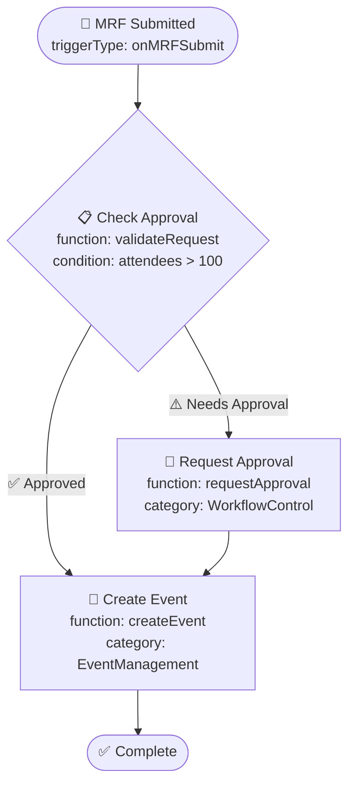

# User Story: Basic Workflow Visualization Engine

**As a** workflow creator  
**I want** to see a visual representation of my workflow as a flowchart  
**So that** I can understand the workflow logic and identify potential issues

## Summary
Implement Mermaid diagram generation from workflow JSON with react-md-editor integration, dynamic function metadata display, and validation error visualization.

## Epic
[Epic: Workflow Configurator Screen](epic-workflow-configurator.md)

## UI Considerations
- Diagrams should be responsive and readable on all screen sizes
- Color coding for different step types, function categories, and validation states
- Clear visual flow indicators showing step connections and data flow
- Function metadata display on step hover (name, description, parameters)
- Validation error highlighting with visual indicators
- Loading states during diagram generation and function metadata loading
- Progressive disclosure for complex workflows (collapsible sections)
- Zoom and pan capabilities with minimap for navigation
- Accessibility support for screen readers and keyboard navigation

## Acceptance Criteria
- [ ] Implement JSON-to-Mermaid conversion logic with functions library integration
- [ ] Integrate react-md-editor v4 for Mermaid diagram rendering
- [ ] Support all workflow step types with dynamic function metadata:
  - [ ] Trigger steps (start points) with trigger source information
  - [ ] Condition steps (decision diamonds) with condition logic preview
  - [ ] Action steps (process rectangles) with function names and categories
  - [ ] End steps (terminal states) with success/failure indicators
- [ ] Handle conditional branching (onSuccess/onFailure paths) with clear visual flow
- [ ] Implement dynamic color coding based on:
  - [ ] Step types (trigger, condition, action, end)
  - [ ] Function categories from the functions library
  - [ ] Validation states (valid, warning, error)
  - [ ] Execution states (pending, running, complete, failed)
- [ ] Add rich step labels with function metadata from dynamic library
- [ ] Support parallel workflow branches with synchronization points
- [ ] Handle complex nested conditions with collapsible views
- [ ] Implement validation error overlay with step highlighting
- [ ] Add function parameter preview on step interaction
- [ ] Create diagram caching with invalidation on library updates
- [ ] Add diagram export functionality (SVG, PNG, PDF)
- [ ] Create responsive layout with progressive disclosure
- [ ] Implement diagram versioning for workflow history
- [ ] Add comprehensive unit tests for conversion logic and functions integration
- [ ] Include visual regression tests for diagram consistency across function updates
- [ ] Add accessibility tests for screen reader compatibility
- [ ] Document visualization rules, function display conventions, and extension points

## Developer Notes

### Enhanced Visualization Architecture
```typescript
interface VisualizationEngine {
  generateMermaid(workflow: WorkflowJSON, options: VisualizationOptions): Promise<string>;
  renderDiagram(mermaid: string, container: HTMLElement): Promise<void>;
  updateStepMetadata(stepId: string, functionData: FunctionDefinition): void;
  highlightValidationErrors(errors: ValidationError[]): void;
  applyTheme(theme: DiagramTheme): void;
}

interface VisualizationOptions {
  showFunctionDetails: boolean;
  showValidationStates: boolean;
  showExecutionStates: boolean;
  collapseComplexSections: boolean;
  theme: DiagramTheme;
  exportFormat?: 'svg' | 'png' | 'pdf';
}

interface StepVisualization {
  stepId: string;
  stepType: 'trigger' | 'condition' | 'action' | 'end';
  functionInfo?: FunctionDefinition;
  validationState: 'valid' | 'warning' | 'error';
  executionState?: 'pending' | 'running' | 'complete' | 'failed';
  position: DiagramPosition;
  connections: Connection[];
}
```

### Dynamic Function Integration
- **Function Metadata Display**: Rich tooltips with function descriptions, parameters, and examples
- **Category-Based Coloring**: Visual distinction between function categories (approval, validation, integration, etc.)
- **Dynamic Updates**: Diagram automatically updates when functions library changes
- **Function Documentation Links**: Direct access to function documentation from diagram

### Mermaid Diagram Mapping with Functions Integration


### Color Coding System
- **Step Types**:
  - Trigger: Green rounded rectangle with rocket icon
  - Condition: Yellow diamond with decision icon
  - Action: Blue rectangle with function category icon
  - End: Green/Red rounded rectangle with status icon
- **Function Categories**:
  - Approval: Purple accent
  - Validation: Orange accent
  - Integration: Teal accent
  - EventManagement: Blue accent
  - WorkflowControl: Gray accent
- **Validation States**:
  - Valid: Normal colors
  - Warning: Yellow border
  - Error: Red border with error icon

### Technical Implementation
- Use Mermaid v11 syntax with enhanced node styling
- Implement diagram caching with function library version tracking
- Handle large workflows with collapsible subgraphs
- Support real-time updates during function library changes
- Progressive rendering for complex workflows
- Accessibility features with ARIA labels and keyboard navigation

### Performance Optimizations
- **Diagram Caching**: Cache generated Mermaid with function metadata
- **Lazy Loading**: Load function metadata on demand
- **Virtual Scrolling**: Handle large workflows efficiently
- **Incremental Updates**: Only regenerate changed portions
- **Image Optimization**: Compress exported diagrams

### Testing Requirements
- Unit tests for JSON-to-Mermaid conversion with functions integration (90%+ coverage)
- Integration tests with react-md-editor component and functions library
- Visual regression tests for diagram consistency across function library updates
- Performance tests with large workflow diagrams and many functions
- Accessibility tests for screen readers and keyboard navigation
- Function metadata display testing
- Validation error visualization testing

### Security Notes
- Sanitize workflow data and function metadata before Mermaid generation
- Validate Mermaid syntax to prevent XSS in diagram rendering
- Implement content security policy for embedded diagrams
- Secure function metadata access based on user permissions
- Validate function library integrity before visualization
- Prevent injection attacks through function parameter display